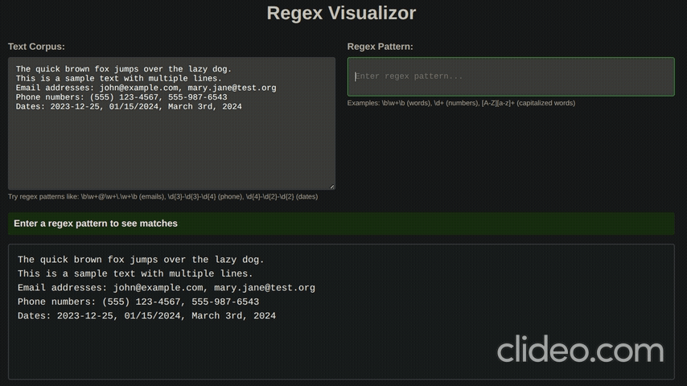

# REGEX Visualizor

This was a simple experiment with Claude Code to generate a real-time regex visualizor. The total cost was $0.83 and 2m43s. 



## Project Overview

This is a regex visualization web application built with Flask and javascript that provides real-time highlighting of regex matches in a text corporus. The application allows users to input text and regex patterns, and see the regex matches highlighted instantly as they type.

## Architecture

- **main.py**: Flask web server with two routes:
  - `/`: Serves the main HTML interface
  - `/match`: API endpoint that processes regex matching requests
- **templates/index.html**: Single-page application with HTML, CSS, and JavaScript for the user interface
- Uses uv for Python package management

## Development Commands

### Running the Application
```bash
uv run main.py
```
The app will be available at http://127.0.0.1:5000 and automatically opens in debug mode.

### Managing Dependencies
```bash
# Add a new dependency
uv add <package_name>

# Install dependencies
uv sync
```

## Core Functionality

### Regex Processing
The `/match` endpoint in main.py handles regex compilation and text matching using Python's `re` module with `MULTILINE` and `DOTALL` flags. It returns JSON with highlighted HTML and match counts.

### Real-time Updates
The frontend uses JavaScript debouncing (300ms) to make API calls as users type, preventing excessive server requests while maintaining responsive feedback.

### Error Handling
Invalid regex patterns are caught and displayed to users without crashing the application. HTML escaping prevents XSS vulnerabilities.

## Key Files
- `main.py`: Flask application entry point
- `templates/index.html`: Complete frontend implementation
- `pyproject.toml`: UV package configuration (auto-generated)